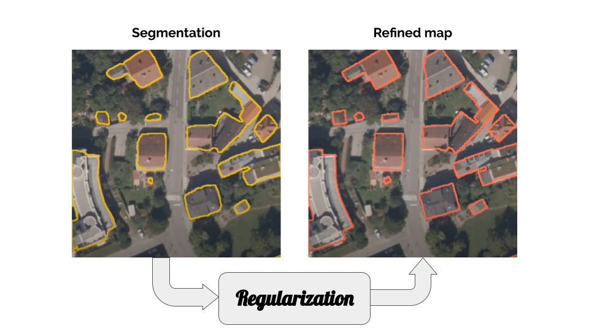

# Regularization of Building Boundaries in Satellite and Aerial Images
This repository contains the implementation for our publication "Machine-learned regularization and polygonization of building segmentation masks", ICPR 2021. 
If you use this implementation please cite the following publication:

~~~
@inproceedings{zorzi2021machine,
  title={Machine-learned regularization and polygonization of building segmentation masks},
  author={Zorzi, Stefano and Bittner, Ksenia and Fraundorfer, Friedrich},
  booktitle={2020 25th International Conference on Pattern Recognition (ICPR)},
  pages={3098--3105},
  year={2021},
  organization={IEEE}
}
~~~
and
~~~
@inproceedings{zorzi2019regularization,
  title={Regularization of building boundaries in satellite images using adversarial and regularized losses},
  author={Zorzi, Stefano and Fraundorfer, Friedrich},
  booktitle={IGARSS 2019-2019 IEEE International Geoscience and Remote Sensing Symposium},
  pages={5140--5143},
  year={2019},
  organization={IEEE}
}
~~~

Explanatory video of the approach:

# Dependencies

*  cuda 10.2
*  pytorch >= 1.3
*  opencv
*  gdal

# Running the implementation
After installing all of the required dependencies above you can download the pretrained weights from [here](https://drive.google.com/drive/folders/1IPrDpvFq9ODW7UtPAJR_T-gGzxDat_uu?usp=sharing).

Unzip the archive and place *saved_models_gan* folder in the main *projectRegularization* directory.

Please note that the polygonization step is not yet available!
 
## Evaluation
Modify *variables.py* accordingly, then run the prediction issuing the command

~~~
python regularize.py
~~~

## Training
Modify *variables.py* accordingly, then run the training issuing the command

~~~
python train_gan_net.py
~~~
